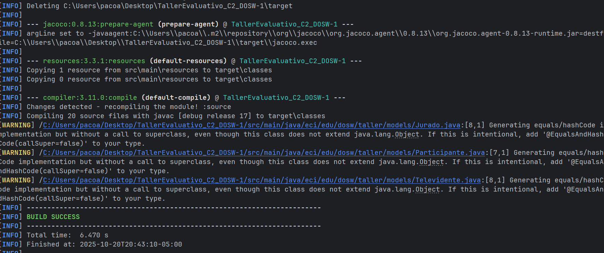
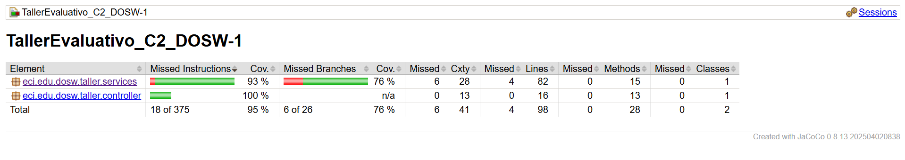
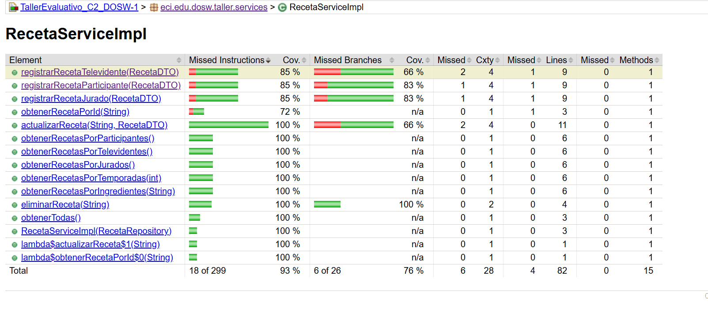
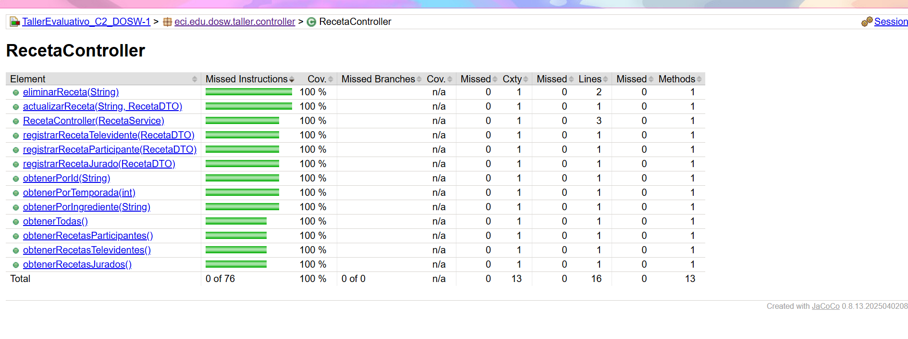
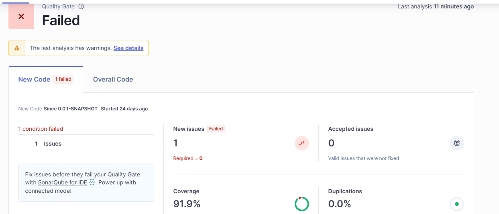
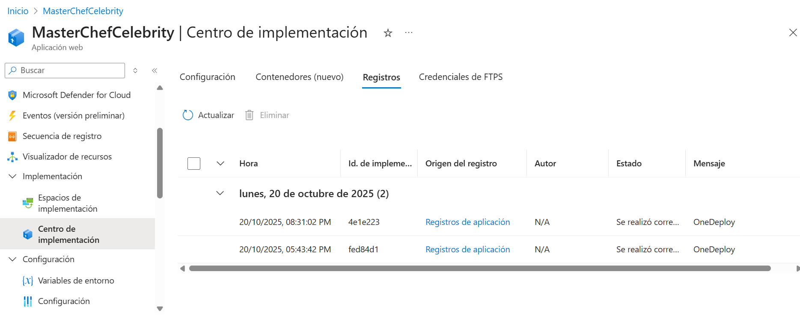
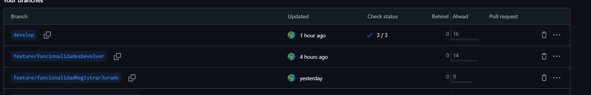
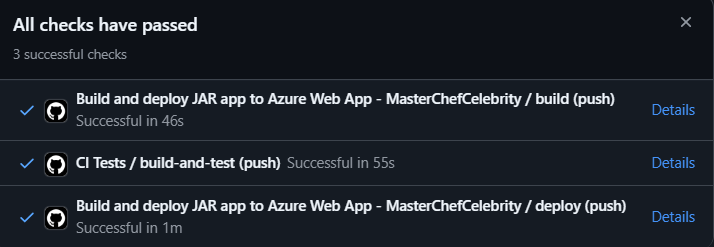
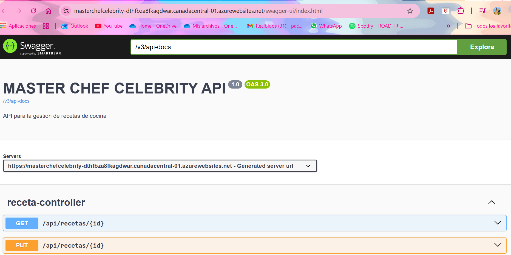

# TallerEvaluativo_C2_DOSW-1
**Integrantes:**
- Oscar Andres Sanchez Porras.

**Nombre De la Rama:**
`develop`
---
## Estrategia de Versionamiento y ramas.

**Template ramas**
`feature/Path-Tarea`

- main: Versión estable para PREPROD
- develop: Rama principal de desarrollo
- feature/*: Manejo de implementaciones

## Descripción del proyecto
API REST para gestionar recetas de cocina del programa de telerrealidad **Máster Chef Celebrity**. Permite a televidentes, concursantes y chefs registrar, consultar, actualizar y eliminar recetas. También se pueden filtrar por temporada o ingrediente.

La API usa **MongoDB** como base de datos y cuenta con pruebas unitarias. Se implementa CI/CD con GitHub Actions y despliegue automático en **Azure**.

---
## Tecnologías utilizadas

- Java 17
- Spring Boot
- MongoDB
- Swagger (OpenAPI)
- JaCoCo (cobertura de pruebas)
- SonarQube (análisis estático de código)
- Maven (gestión de dependencias y build)
- Azure
- GitHub Actions
---
## Instrucciones de instalación y ejecución local.
### Maven 

Se puede evidenciar como al ejecutar mvn compile genera el maven, lo que 
significa que esta parte esta bien configurada y sin alteraciones en los codigos.
### Jacoco
Al ejecutar el codigo mvn clean verify se evidencia la creacion del jacoco.

En esta parte se configuro en el pom para que filtrara las coberturas de las pruebas 
de las clases controller y service que son las que nos interesan para probar.

En  esta clase de service se evidencia que tanta cobertura tiene cada metodo con los test que definimos, se 
requiere por lo menos un 80% de cobertura.

En  esta clase de controller se evidencia que tanta cobertura tiene cada metodo con los test que definimos, se
requiere por lo menos un 80% de cobertura.
### SonarQube

Al generar el token y ejecutar el comando para verificar las pruebas
en sonarqube se genera el siguiente link donde se observa que falla pero el fallo de debe
a que no reconoce el package que genera Automaticamente Spring Boot al crear el estruturado
lo que significa que no es fallo de el codigo.
### Swagger

### Azure

Al entrar a Azure hacemos la conexion con gitHub en el apartado de centro de implementaciones
donde se escoge el repositorio y la rama, despues de hacer ese vinculo se tiene que ver los registros ya que estos prueban
de que si fue exitosa la conexion, en caso de un fallo dira error.
### GIT ACTIONS

Al configurar nuestors CI/CD nos aparece una verificacion de que pasa el codigo
esta se reinicia cada vez que hay un push osea puede fallar con implementaciones complejas.

Una vez que se verifiquen se observara que en detalles se puede ver que la configuracion este bien y si hay fallos hay mostrara que fallo hay

Finalmente una vez pasadas todas las pruebas se podra abrir el API de azure
al cual configuramos para que abra directamente el Swagger.
---